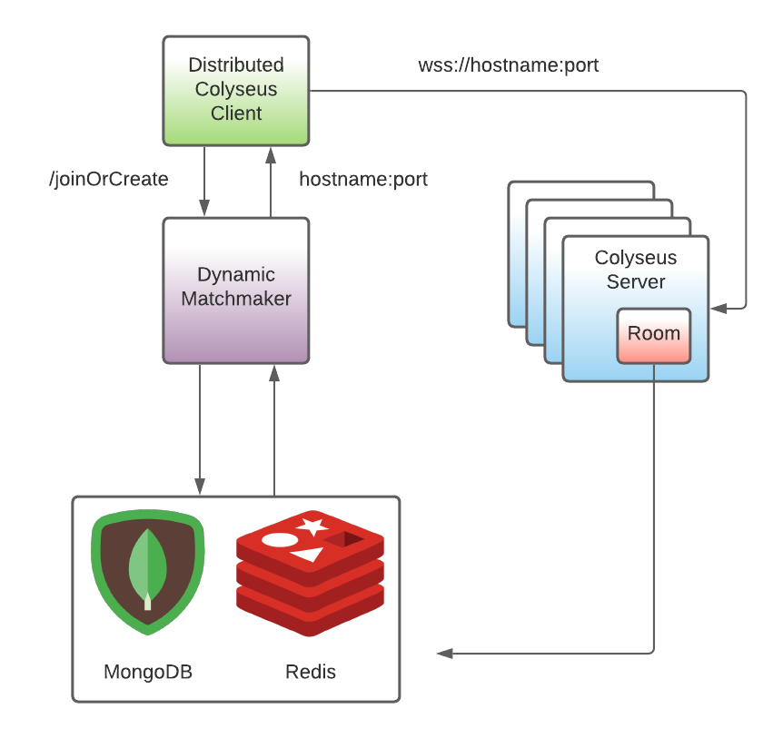

# Colyseus Distributed Matchmaker
Colyseus distributed matchmaker allows you to horizontally scale your [colyseus games](https://colyseus.io) in a linearly scalable fashion.

;

*Note1: The distributed client is still a world in progress.  A sample implementation is at the bottom of this readme*

*Note2: at the moment the DistributedColyseusClient only supports a subset of the Colyseus API*

# Design Goals
- maintain linear scaling (if 10 clients can be hosted by 1 server, 100 clients should be hosted by 10 servers)
- preserve colyseus' matchmaking abilities
- matchmake across colyseus nodes
- be cluster agnostic
- recover from server failures
- allow for arbitary turn up/shutdown

# Quickstart

## Dependencies
The colyseus distributed matchmaker uses both colyseus' matchmaking and presence APIs.
Configure your servers with both the Colyseus [MongooseDriver](https://docs.colyseus.io/scalability/) and [RedisPresence](https://docs.colyseus.io/server/presence/).

```typescript
import { Server, RedisPresence } from "colyseus";
import { MongooseDriver } from "colyseus/lib/matchmaker/drivers/MongooseDriver"

const gameServer = new Server({
  // ...
  driver: new MongooseDriver(),
  presence: new RedisPresence()
});
```

The distributed matchmaker also relies on colyseus [discovery](https://github.com/colyseus/colyseus/blob/master/src/discovery/index.ts).
In Kubernetes you'll need to configure your servers with the `SELF_HOSTNAME` and `SELF_PORT` environment variables.  

Next - you'll need to use the Presence API in your rooms to register the room names with hostname reporting:
```
class MyRoom extends Room {
  async onCreate() {
    const path = process.env.SELF_HOSTNAME + ':' + process.env.SELF_PORT;
    const TWENTY_FOUR_HR_TIMEOUT = 1000 * 60 * 60 * 24;
    // Hopefully no rooms last longer than 24 hrs.
    await this.presence.setex(this.roomId, path, TWENTY_FOUR_HR_TIMEOUT);
  }

  onDispose() {
    this.presence.del(this.roomId);
  }
}
```

This is used internally by the distributed matchmaker.  
At some point this will be hopefully be done automatically.

## Deployment
You can run the distributed matchmaker locally for testing:
```bash
git clone https://github.com/LukeWood/colyseus-distributed-matchmaker
cd colyseus-distributed-matchmaker
yarn && yarn start
```

In prod you'll probably want to run the docker image (Coming soon!!!).

## Client Usage
You'll want to use the [DistributedColyseusClient](https://github.com/LukeWood/distributed-colyseus-client) with the matchmaker.

The DistributedColyseusClient takes a `matchmakerEndpoint` as a parameter.  
You can just use it like a normal colyseus client - it will connect to the proper server internally.

```
const client = new DistributedColyseusClient('/localhost:7337');
client.joinOrCreate(ROOM_NAME);
```

# Roadmap
- Heartbeat to detect crashed servers
- Implement the full colyseus client API (right now only joinOrCreate & joinById are supported)
- Introduce the presence portion to the colyseus server api

# Distributed Client
```
import {Room, Client} from 'colyseus.js';

export class DistributedColyseusClient {

  constructor(readonly matchmakerEndpoint: string) {}

  async joinOrCreate<T extends any>(roomName: string, options: any): Promise<Room<T>> {
    const requestBody = {roomName: roomName};
    let response = await fetch(this.matchmakerEndpoint + '/joinOrCreate', {
        method: 'POST',
        body: JSON.stringify(requestBody),
        headers: {
          'Content-Type': 'application/json'
        }
    })
    const server = (await response.json()).server;
    return new Client(this.wsprotocol + server).joinOrCreate(roomName, options);
  }

  get wsprotocol():string {
    return window.location.protocol === 'https' ? 'wss://' : 'ws://';
  }
}
```
